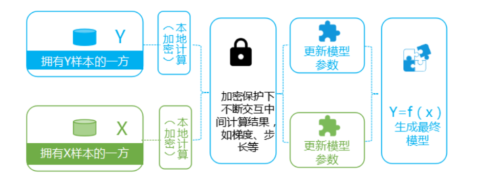
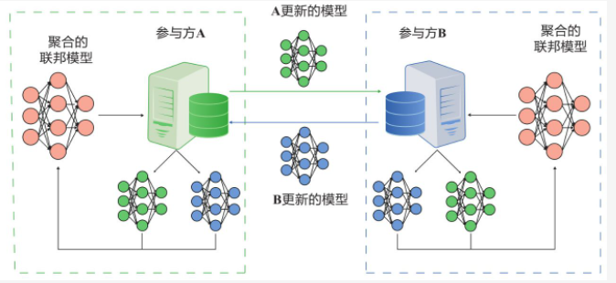

# 调研报告：联邦机器学习技术

## 背景
随着机器学习技术的迅速发展，人工智能已经广泛应用到社会服务中去。然而，精准的模型需要大量的质量优秀的数据集，少量且质量差的数据不能支撑人工智能技术的实现，并且不同行业甚至不同部门之间都存在着数据壁垒，形成了**数据孤岛**。
另一方面，传统的机器学习需要把数据集中起来进行模型训练，这将导致**数据安全**和**隐私保护**问题。在法律上对于数据的监管也逐渐加强，2018年盟开始执行《通用数据保护条例》（GDPR），2020年美国的《加利福尼亚州消费者隐私保护法》（CCPA）正式生效，以及我国的《中华人民共和国民法通则》、《中华人民共和国网络安全法》都对数据的收集和处理提出了严格的约束和控制要求，不允许企业之间粗暴交换数据。
在此背景下，联邦学习应运而生。联邦学习最早是由谷歌于2016年提出的，用于解决定期的更新智能手机上的语言模型。微众银行AI团队则从金融行业实践出发，关注跨机构跨组织的大数据合作场景，首次提出“联邦迁移学习”的解决方案，将迁移学习和联邦学习结合起来。
## 联邦学习
### 定义
联邦机器学习(Federated machine learning/Federated Learning)，又名联邦学习，联合学习，联盟学习，它本质上是一种**分布式机器学习技术**。联邦学习的目标是在保证数据隐私安全及合法合规的基础上，实现共同建模，提升AI模型的效果。
### 特点
- 有两个或以上的参与者协作构建一个共享的机器学习模型。每个参与方拥有若干能够用来训练模型的数据。
- 各方数据都**保留在本地**，不泄露隐私也不违反法规；
- 模型相关的信息能够以加密方式在各方传输，并且任一参与方都不能推测出其他方的原始数据。
- 各个参与者联合数据建立虚拟的**共有模型**，并且**共同获益**的体系；
- 在联邦学习的体系下，各个参与者的**身份和地位相同**；
- 联邦学习的建模效果和将整个数据集放在一处建模的**效果相同**，或相差不大；
- 迁移学习是在用户或特征不对齐的情况下，也可以在数据间通过**交换加密参数**达到知识迁移的效果。

下图是一个联邦学习的示意图。

### 架构
根据应用场景的不同，联邦学习选择有没有中央协调放，按照服务器-客户端架构，也可以对等架构。
#### B/S架构
中央协调放是参数服务器，将初始模型分发给参与方。参与方分别使用各自数据集训练，并将模型权重更新发送到服务器。服务器聚合更新后将模型发回。

#### P2P架构
各方无须借助第三方直接通信，但需要更多加解密工作。

### 分类
根据多参与方之间数据分布的不同，把联邦学习分为三类：横向联邦学习、纵向联邦学习和联邦迁移学习。
#### 横向联邦学习
横向联邦学习的本质是样本的联合，适用于参与者间业态相同但触达客户不同，即特征重叠多，用户重叠少时的场景，比如不同地区的银行间，他们的业务相似（特征相似），但用户不同（样本不同）。

- 业态相同或相似
- 特征重叠多，用户重叠少
- 样本联合

**具体步骤**

1. 参与方各自从服务器A下载最新模型；
2. 每个参与方利用本地数据训练模型，加密梯度上传给服务器A，服务器A聚合各用户的梯度更新模型参数；
3. 服务器A返回更新后的模型给各参与方；
4. 各参与方更新各自模型。

每台机器下都是**相同且完整**的模型，且机器之间不交流不依赖，在预测时每台机器也可以独立预测，可以把这个过程看作成基于样本的分布式模型训练。谷歌最初就是采用横向联邦的方式解决安卓手机终端用户在本地更新模型的问题的。

#### 纵向联邦学习
纵向联邦学习的本质是特征的联合，适用于用户重叠多，特征重叠少的场景，比如同一地区的商超和银行，他们触达的用户都为该地区的居民（样本相同），但业务不同（特征不同）。

- 触达用户相同或相似
- 特征重叠少，用户重叠多
- 特征联合

**具体步骤**
系统构架由两部分构成，如下图所示。

- **加密样本对齐**
由于两家企业的用户群体并非完全重合，系统利用基于加密的用户样本对齐技术，在 A 和 B 不公开各自数据的前提下确认双方的共有用户，并且不暴露不互相重叠的用户，以便联合这些用户的特征进行建模。
- **加密模型训练**
在确定共有用户群体后，就可以利用这些数据训练机器学习模型。为了保证训练过程中数据的保密性，需要借助第三方协作者 C 进行加密训练。以线 回归模型为例，训练过程可分为以下 4 步：
  1. 分发公钥
  协作者 C 把公钥分发给 A 和 B，用以对训练过程中需要交换的数据进行加密；
  2. 加密交互中间结果
  A 和 B 之间以加密形式交互用于计算梯度的中间结果；
  3. 加密汇总梯度与损失
  A 和 B 分别基于加密的梯度值进行计算，同时 B 根据其标签数据计算损失，并把这些结果汇总给 C，C 通过汇总结果计算总梯度并将其解密；
  4. 更新双方模型
  C 将解密后的梯度分别回传给 A 和 B；A 和 B 根据梯度更新各自模型的参数。

迭代上述步骤直至**损失函数收敛**，这样就完成了整个训练过程。在样本对齐及模型训练 过程中，A 和 B 各自的数据均保留在本地，且训练中的数据交互也不会导致数据隐私泄露。因此，双方在联邦学习的帮助下得以实现合作训练模型。

在整个过程中参与方都不知道另一方的数据和特征，且训练结束后参与方只得到自己侧的模型参数，即**半模型**，预测时需要双方协作完成。

#### 联邦迁移学习
当参与者间特征和样本重叠都很少时可以考虑使用联邦迁移学习，如不同地区的银行和商超间的联合。主要适用于以深度神经网络为基模型的场景。

- 业态、用户均交集较少
- 特征重叠多，用户重叠少
- 迁移学习

联邦迁移学习的步骤与纵向联邦学习相似。

### 开源框架
有很多关于联邦学习的开源项目正在迅速发展，如：
- **Federated AI Technology Enabler(FATE)**
这是由微众银行人工智能项目组发起的一个开源项目，该项目提供了一个安全计算框架和联邦学习平台。它实现了一种基于同态加密和多方计算的安全计算协议，支持一系列的联邦学习架构和安全计算算法。
- **TensorFlow Federated(TFF)**
这是一个为联邦学习和其他计算方法在去中心化数据集上进行试验的开源框架，让开发者能在自己的模型和数据上模拟实验现有的联邦学习算法。
- **TensorFlow-Encrypted**
大监狱TensorFlow顶层的Python包，可以让研究人员使用面向隐私保护的机器学习方式进行试验，提供了类似于TensorFlow接口。

其他类似于coMind、Horovod等等开源平台和框架都在不断的发展中。

## 通信效率
联邦学习领域仍存在许多威胁与挑战，如在联邦学习网络中，服务器与远程客户端之间往往需要进行不断的通信来交互模型更新信息，动辄万计的客户端很容易对通信网络造成巨大的带宽负担。通常，全局模型训练时间分为数据处理时间和通信传输时间两部分，而随着计算机设备算力的提升，数据处理时间不断降低，联邦学习的**通信传输效率**变成限制其训练速度的主要因素。

联邦学习与分布式计算的区别是联邦学习的数据集来自各个终端用户，这些用户产生的数据特征往往呈**非独立同分布**(Non-IID)。

在互联网环境中，大量本地模型更新的上传会导致**中心服务器通信开销过大**，无法满足正常的应用要求，同时相近几次模型更新中可能会包含许多重复更新或者与全局模型不相关的更新。
因此，联邦学习的通信效率优化具有重要的研究意义。通常改进方案有两个目标：
- 减少每轮通信传输的数据大小；
- 减少模型训练的总轮数。

目前，改进通信效率方案主要是通过**优化联邦学习框架算法**、**压缩模型更新**和采用**分层分级**的训练架构。这些方法一定限度上提升了联邦学习模型训练速度和减小了数据通信量，对联邦学习技术的完善具有重大意义，但是现阶段仍然存在许多难以解决的问题。例如，优化算法在处理Non-IID 数据时相对于处理 IID 数据的时间开销成倍增长 ；压缩算法虽然能够显著降低通信数据大小，但同时会严重影响模型精度，在通信效率和模型精度之间的平衡成为挑战；分层分级的训练架构也不适合于所有的联邦学习场景，有时这种物理结构并不存在。

在之后的研究过程中，我们着重学习如何在模型的分发处理上有更好的提升。
## 参考文献
1. MCMAHAN H B, MOORE E, RAMAGE D, et al. Communication-efficient learning of deep networks from decentralized data[J]. Artificial Intelligence and Statistics, 2017: 1273–1282.

2.  Yang Q ,  Liu Y ,  Chen T , et al. Federated Machine Learning: Concept and Applications[J]. ACM Transactions on Intelligent Systems and Technology, 2019, 10(2):1-19.

3. Konen J ,  Mcmahan H B ,  Yu F X , et al. Federated Learning: Strategies for Improving Communication Efficiency[J].  2016.

4. Advances and Open Problems in Federated Learning[J].  2019.

5. YANG Q. AI and data privacy protection: the cracking method of federated learning[J].Information Security Research.2019,5(11):961-965.

